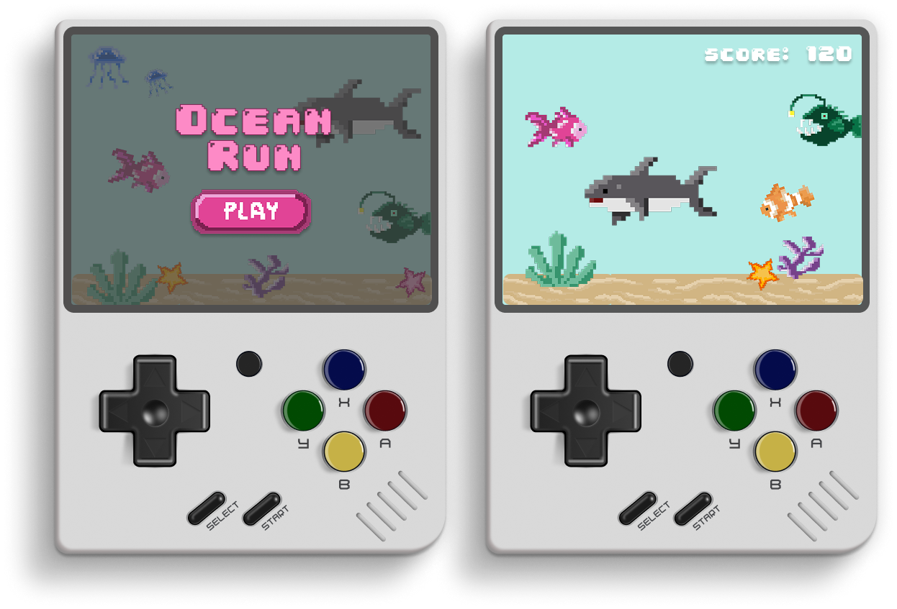

# 🌊 Ocean Run: Just Keep Swimming! 🐟

Ahoy, mateys! Dive into Ocean Run, a silly, pixel-art adventure inspired by the Chrome Dino Game! I made this to experiment with Aseprite and create some goofy drawings.

**Play Now!** [https://amparooliver.github.io/Ocean-Game/](https://amparooliver.github.io/Ocean-Game/)

## 🕹️ How to Play:

* Use the **up and down arrow keys** to avoid obstacles.
* On touch screens, **swipe up or down**.
* Just keep swimming and beat your high score!

## 🛠️ Tech:

* **The Holy Trinity:** HTML, CSS, JavaScript (for simplicity and giggles)
* All pixel art created in Aseprite.

## 💡 Why?:

Purely for Aseprite experimentation and silly drawing fun!
